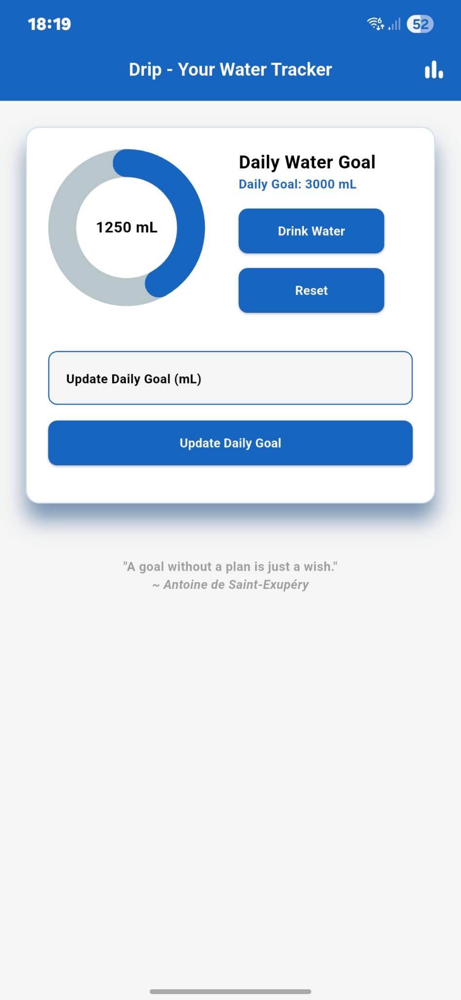
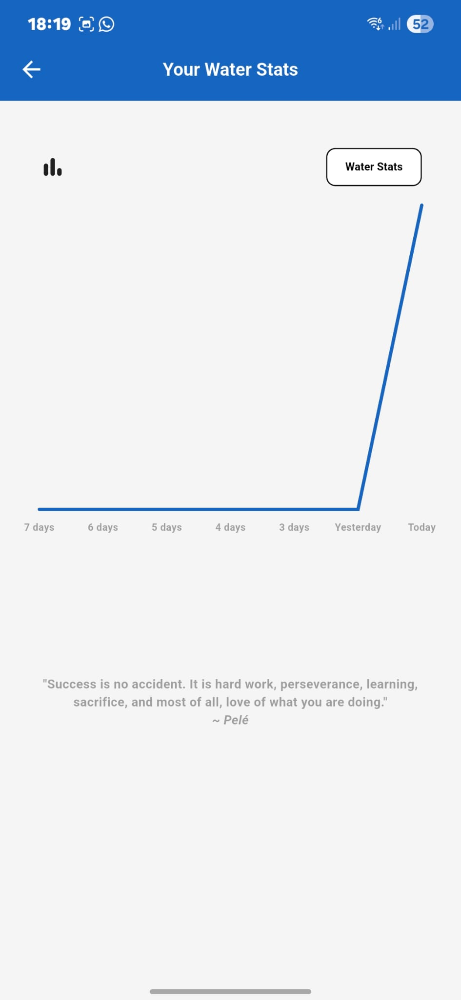

# 💧 Drip - Water Tracking App

A simple and intuitive mobile app to track your daily water intake and stay hydrated.

## ✨ Features

- 💦 Daily water intake tracking
- 📊 Visual charts showing last 7 days consumption
- 🌞 Light mode interface
- 📱 Clean and minimal design
- ⚡ Fast and smooth user experience
- 🎯 Easy-to-use water logging

## 📱 Download

Download the latest APK from the [Releases](https://github.com/pamiracar/drip/releases) page.

## 🚀 Usage

1. Open the app
2. Log your water intake throughout the day
3. View your hydration progress with interactive charts
4. Track your 7-day water consumption history

## 💻 Built With

- **Flutter** - UI framework
- **Dart** - Programming language

## 🎯 Purpose

This app was developed to help users build healthy hydration habits and track their daily water intake for better health and wellness.

## 📸 Screenshots

<!-- Add screenshots here -->

  
  

## 📝 License

This project is licensed under the MIT License.

## 📧 Contact

Project Owner: [pamiracar](https://github.com/pamiracar)

---

⭐ If you like this project, don't forget to give it a star!
